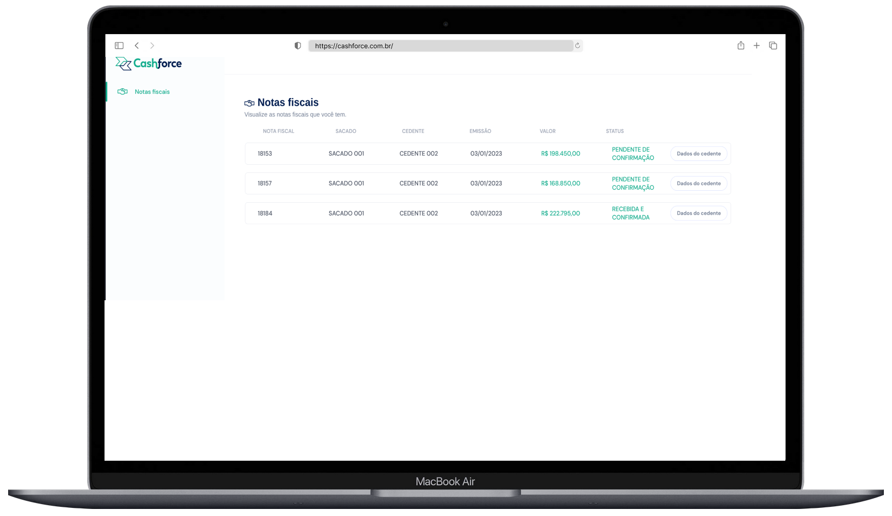

# cashforce-app





## :computer: Sobre

Aplicação para o processo seletivo da CashForce. A mesma consiste em uma página web que exibe o resultado da consulta realizada em uma API pública de dados construído para a aplicação.


## 👨‍💻 Requisitos

**Solicitados:**
* Desenvolver uma página web utilizando o framework Vue.js.
* Contruir um API em Node utilizando o frameworks express e o sequelize.

**Extras:**
* Utilizar o framework chai para testes de integração.
* Utilizar o framework swagger para documentação da API.
* Utilizar o docker para construir o ambiente de desenvolvimento.

## :hammer: Ferramentas

* Vue.js
* Vite
* Express
* Sequelize
* MySQL
* Docker
* Swagger
* Chai
* Typescript
<br />
<hr />
## :sparkles: Executando a aplicação
<details>
  <summary markdown="span"><strong>Via Docker Compose (Recomendado)</strong></summary><br />

  :warning:  **É necessário ter o Docker e o Docker Compose instalados na máquina.**

  > Após clonar o repositório, sequir os sequintes passos.

  
  **Subindo os containers com as imagens**

  - Acessar o diretório raiz do projeto e execute o seguinte comando:
  ```bash
  docker-compose up --build
  ```

  **Acessando a aplicação**

  - Para Acessar a aplicação é só digitar a seguinte URL em seu navegador: http://localhost:8080

  <br />

  **Parando os containers**

  ```bash
  ctrl + c
  ```
  
<br />

  **Removendo os containers**

  ```bash
  docker-compose down
  ```

<br />
</details>
<br />

<details>
  <summary markdown="span"><strong>Localmente</strong></summary><br />

  :warning:  **É necessário ter o Node.js e o MySql instalados na máquina.**
  
  
  > Após clonar o repositório, seguir os seguintes passos.
  
  
  
  **Back-end**
  
  - Acessar o diretório do back-end.
  ```bash
  cd backend 
  ```

  - Definir as varáveis de ambiente em um arquivo .env; 
    - É necessário criar um arquivo .env na raiz do diretório do back-end.
    - A seguir, definir as seguintes variáveis de ambiente:
    - Exemplo:
  
  ```env
  DB_HOST=localhost
  DB_USER=root
  DB_PASS=docker
  DB_NAME=cashforce 
  DB_PORT=3306
  ```

  - OBS: o arquivo example.env contém um exemplo de como deve ser o arquivo .env.
    - É necessário renomear o arquivo example.env para .env. e preencher as variáveis de ambiente conforme sua configuração.

  - Instalar as dependências.
  ```bash  
  npm install
  ``` 
  
  - Rodar o back-end.
  ```bash  
  npm start
  ```

  <br />

  **Front-end**

  - Acessar o diretório do front-end.
  ```bash
  cd frontend 
  ```

  - Instalar as dependências.
  ```bash  
  npm install
  ```
  
  - Rodar o front-end.
  ```bash  
  npm start
  ```
  - Acessar a aplicação em http://localhost:8080
  

<br />
</details>
<br />


<details>
  <summary markdown="span"><strong>Localmente com o DB já presente</strong></summary><br />

  :warning:  **É necessário ter o Node.js instalado na máquina.**
  
  > Após clonar o repositório, seguir os seguintes passos.
    
  **Back-end**
  
  - Acessar o diretório do back-end.
  ```bash
  cd backend 
  ```

  - Definir as varáveis de ambiente em um arquivo .env; 
    - É necessário criar um arquivo .env na raiz do diretório do back-end.
    - A seguir, definir as seguintes variáveis de ambiente:
    - Exemplo:
  
  ```env
  DB_HOST=localhost
  DB_USER=root
  DB_PASS=docker
  DB_NAME=cashforce 
  DB_PORT=3306
  ```

    - OBS: o arquivo example.env contém um exemplo de como deve ser o arquivo .env.
      - É necessário renomear o arquivo example.env para .env. e preencher as variáveis de ambiente conforme sua configuração.

  - Instalar as dependências.
  ```bash  
  npm install
  ``` 
  
  - Rodar o back-end.
  ```bash  
  npm run dev
  ```

  <br />

  **Front-end**

  - Acessar o diretório do front-end.
  ```bash
  cd frontend 
  ```

  - Instalar as dependências.
  ```bash  
  npm install
  ```
  
  - Rodar o front-end.
  ```bash  
  npm start
  ```
  
  - Acessar a aplicação em http://localhost:8080


<br />
</details>


<br />
<hr />

## :pushpin: testes de integração
<details>
  <summary markdown="span"><strong>Rodando os testes</strong></summary><br />

  > Após subir o back-end, executar os comandos abaixo.
  
  - Acessar o diretório do back-end.
  ```bash
  cd backend 
  ```
  
  - Executar os testes.
  ```bash
  npm run test
  ```

<br />
</details>

<br />
<hr />

## :memo: consultando a documentação da API
<details>
  <summary markdown="span"><strong>Consultando a API</strong></summary><br />

  > Com o back-end rodando, acessar a seguinte URL em seu navegador:

    
  http://localhost:3001/api-docs

<br />
</details>
  